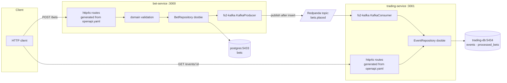

# scalaLearningProject

A small sports-betting platform built as a Scala learning project: two independent
microservices communicating over Kafka (Redpanda), each backed by its own Postgres
database, with the HTTP contract for each service defined and generated from OpenAPI.

## Services

| Service           | Responsibility                                              | Port |
|-------------------|--------------------------------------------------------------|------|
| `bet-service`     | Accepts bets, persists them, publishes `BetPlaced` events    | 3000 |
| `trading-service` | Owns betting events, consumes `BetPlaced`, updates counters  | 3001 |

Shared module:
- **`contracts`** — the `BetPlaced` event schema (Circe codecs) shared by producer and consumer.

## Architecture



## Getting started (from a fresh clone)

1. **Start everything (Docker-only workflow):**
   ```bash
   docker compose up --build
   ```
   This builds and starts Postgres (×2), Redpanda (+ console), Adminer, `bet-service`,
   and `trading-service`. OpenAPI code generation runs inside each Docker image build —
   no local `openapi-generator` install required. Table creation is handled by each
   service's Flyway migrations on startup.

   > If you already have volumes from a previous run, Flyway will detect the existing
   > `flyway_schema_history` and skip already-applied migrations automatically.
   > To reset everything: `docker compose down -v && docker compose up --build`.

2. **Try it:**
    - Swagger UI: `http://localhost:3000/swagger-ui` and `http://localhost:3001/swagger-ui`
    - Redpanda Console: `http://localhost:8081`
    - Adminer: `http://localhost:8080` (server `db`, user/pass `postgres`)
   ```bash
   curl -X POST http://localhost:3000/bets \
     -H "Content-Type: application/json" \
     -d '{"event_id":"22222222-2222-2222-2222-222222222222","stake":100,"odds":1.85}'
   ```

To stop and clean volumes:
```bash
docker compose down -v
```

## Running services locally (sbt / IntelliJ)

1. **Regenerate OpenAPI artifacts (server + client for both services):**
   ```bash
   docker compose run --rm openapi-generator-bet-server
   docker compose run --rm openapi-generator-bet-client
   docker compose run --rm openapi-generator-trading-server
   docker compose run --rm openapi-generator-trading-client
   ```

2. **Start only infrastructure in Docker:**
   ```bash
   docker compose up -d db trading-db redpanda redpanda-console adminer
   ```

3. **Run `bet-service` with env vars (terminal):**
   ```bash
   BET_SERVICE_DB_URL=jdbc:postgresql://localhost:5433/postgres \
   BET_SERVICE_DB_USER=postgres \
   BET_SERVICE_DB_PASSWORD=postgres \
   KAFKA_BROKERS=localhost:19092 \
   sbt betService/run
   ```

4. **Run `trading-service` with env vars (terminal):**
   ```bash
   TRADING_SERVICE_DB_URL=jdbc:postgresql://localhost:5434/tradingdb \
   TRADING_SERVICE_DB_USER=postgres \
   TRADING_SERVICE_DB_PASSWORD=postgres \
   KAFKA_BROKERS=localhost:19092 \
   KAFKA_GROUP_ID=trading-service-group \
   KAFKA_TOPIC=bets.placed \
   sbt tradingService/run
   ```

5. **Equivalent IntelliJ Environment Variables:**
   - `bet-service`:
     ```text
     BET_SERVICE_DB_URL=jdbc:postgresql://localhost:5433/postgres;BET_SERVICE_DB_USER=postgres;BET_SERVICE_DB_PASSWORD=postgres;KAFKA_BROKERS=localhost:19092
     ```
   - `trading-service`:
     ```text
     TRADING_SERVICE_DB_URL=jdbc:postgresql://localhost:5434/tradingdb;TRADING_SERVICE_DB_USER=postgres;TRADING_SERVICE_DB_PASSWORD=postgres;KAFKA_BROKERS=localhost:19092;KAFKA_GROUP_ID=trading-service-group;KAFKA_TOPIC=bets.placed
     ```

## Manual demo — full round-trip

```bash
EVENT_ID="22222222-2222-2222-2222-222222222222"

# Place 3 bets
for i in 1 2 3; do
  curl -s -X POST http://localhost:3000/bets \
    -H "Content-Type: application/json" \
    -d "{\"event_id\": \"$EVENT_ID\", \"stake\": $((i * 50)).00, \"odds\": 1.85}" \
    | python3 -m json.tool
done

# Verify the counter (allow ~1 s for the consumer to commit)
sleep 1
curl -s http://localhost:3001/events/$EVENT_ID | python3 -m json.tool
# → "betsPlaced": 3
```

### Idempotency check (at-least-once replay)

1. Open **http://localhost:8081** → Topics → `bets.placed`
2. Pick any message, copy its JSON body
3. Click **Produce record** → paste the same body (same `betId`) → **Publish**
4. Re-fetch the event — `betsPlaced` must stay the same
5. Confirm in Adminer (`http://localhost:8080`, DB `tradingdb`):
   `SELECT * FROM processed_bets;` — each `bet_id` appears exactly once

## Running tests & quality gates

```bash
sbt test                  # unit tests
sbt scalafmtCheckAll      # formatting check (apply with: sbt scalafmtAll)
sbt "scalafix --check"    # lint check     (apply with: sbt scalafix)
```

### Verify OpenAPI codegen produces no drift

```bash
docker compose run --rm openapi-generator-bet-server
docker compose run --rm openapi-generator-trading-server
git diff --exit-code bet-service/generated trading-service/generated
# no output → no drift
```

## Design decisions & trade-offs

**Why http4s + cats-effect + doobie + fs2-kafka.** http4s is purely functional and
integrates naturally with cats-effect `IO`; routes are values, not framework magic, so
they compose and test without a running server. doobie turns SQL into `ConnectionIO`
programs that are just values until `.transact(xa)` — this makes the idempotency guard
(INSERT + UPDATE in a single atomic `ConnectionIO` chain) straightforward to reason
about. fs2-kafka wraps the Kafka consumer as a `Stream[IO, _]`, so backpressure,
error recovery, and offset commits are expressed in the same streaming algebra as the
rest of the app rather than in callback hell.

**Why contract-first OpenAPI with generated server stubs.** `openapi.yaml` is the
single source of truth per service. `openapi-generator` produces http4s route traits
`DefaultApiDelegate` must implement; if a handler signature drifts from the spec, it
won't compile. The fix-up script (`fix-generated-server-models.sh`) patches the
generated Circe codecs to use snake_case field names (`event_id`, `created_at`) that
match the wire format. Generation happens inside Docker image builds — no local tooling
required.

**Why publish-after-insert, and the idempotency notes.** In `placeBet`, the DB insert
commits before `BetEventProducer.publish` fires. This means we never publish a
`BetPlaced` for a bet that doesn't exist in the database. The trade-off is the classic
dual-write gap: a crash between the DB commit and the Kafka send loses the event —
today that's only observable in logs, not automatically retried. A transactional outbox
would close that gap; deliberately out of scope this round. On the consumer side,
`trading-service` uses manual offset commits (only after processing) and a
`processed_bets` table — `incrementIfNotProcessed` does `INSERT ... ON CONFLICT DO
NOTHING` keyed on `bet_id` and the counter `UPDATE` in the same doobie transaction, so
a redelivered message is a no-op instead of a double-count.

**Testing strategy.** Tests target what's testable without infrastructure: pure
functions get plain unit tests — `Bet.create` (validation), `BetError.message` and
`EventError.message` (error text), `ErrorMapping.toStatus` (HTTP status mapping),
`BetPlaced` Circe round-trip, `RecordDecoder.decodeRecord` (bytes → domain). Logic that
lives entirely in SQL or Kafka (repositories, consumer stream, Flyway migrations) is
verified manually using the demo above and Adminer. There is no integration test suite
against a live Postgres + Redpanda yet — that is the honest gap if asked.